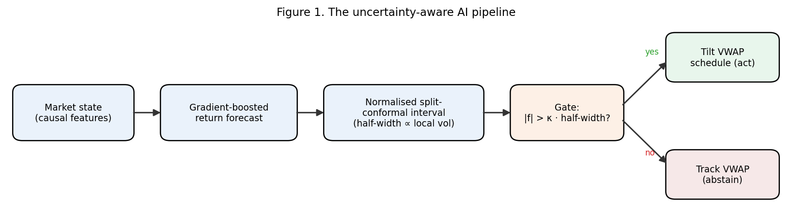

# [Conformal VWAP Execution](https://github.com/Asadullah-Irshad/Conformal-VWAP-Execution/releases/tag/v1.0.0)

### Uncertainty-Aware AI: Conformal Prediction versus Reinforcement Learning for Optimal Trade Execution

[](https://doi.org/10.19139/soic-2310-5070-4159)
[](https://doi.org/10.5281/zenodo.22137734)
[](LICENSE)
[](https://github.com/Asadullah-Irshad/Conformal-VWAP-Execution/actions/workflows/ci.yml)
[](https://www.python.org/)

**Tech stack:**


**The most useful part of a trading model can be knowing when to ignore it.**

Reference code for the paper:

> **Uncertainty-Aware AI: Conformal Prediction versus Reinforcement Learning for Optimal Trade Execution**
> Asadullah Irshad and Shaon Biswas.
> *Statistics, Optimization & Information Computing*, **16**(2), 1334–1349, 2026.
> DOI: [10.19139/soic-2310-5070-4159](https://doi.org/10.19139/soic-2310-5070-4159) · [publisher page](https://iapress.org/index.php/soic/article/view/4159) · published PDF: [`Paper/`](Paper/)

## Project & Research Overview

A fully reproducible study of VWAP-benchmarked trade execution inside a controlled
simulator (stochastic volatility + latent AR(1) momentum). Classical schedules, a
multi-seed PPO agent, and forecast-driven policies built on a **normalised
split-conformal predictor** are placed on a common **cost–risk frontier**. The
headline result: a distribution-free conformal *gate* converts an unstable
forecast edge into a tunable, reproducible variance reduction, more dependably
than an off-the-shelf RL agent.

> Simulator-based research. **No live-trading claims.**

<p align="center">
  
</p>

*Figure 1. The pipeline: market state feeds a gradient-boosted return predictor, which feeds a normalised split-conformal interval, whose width **gates** whether the policy acts on the forecast or falls back to VWAP tracking.*

---

## Highlights

- **A reproducible execution testbed**: a compact, self-contained simulator (stochastic volatility + AR(1) momentum) with all baselines, the learned agent, and scripts that regenerate every table and figure from seed.
- **A conformal gate for execution**: a normalised split-conformal predictor whose distribution-free interval width becomes an explicit gate on *when to act* on the forecast; to the authors' knowledge, the first use of conformal intervals as a decision gate in trade execution (rather than for directional alpha).
- **A like-for-like cost–risk comparison**: classical schedules, a multi-seed PPO agent, and the conformal policies on a single cost–risk frontier under one identical evaluation pipeline, with bootstrap confidence intervals and significance tests.
- **Evidence the guarantee transfers**: validated on real intraday data (30 US large-caps, 5-min bars, 450 held-out sessions), where empirical coverage holds and gating still reduces cost variance.

---

## Methodology

An execution desk does not get to decide *whether* to trade; that arrives from
upstream. What is left is operational: work a large parent order through the
session so the average fill price beats the volume-weighted average price (VWAP),
at low cost **and** low cost-variance.

A point return-forecast can lower average cost, but it raises variance, for an
almost tautological reason: every forecast is sometimes wrong, and acting on all
of them realises every mistake. What is missing is not a better forecast; it is
a calibrated sense of *when the forecast deserves to be acted on*.

Split-conformal prediction supplies exactly that: a distribution-free,
finite-sample interval around any predictor. Here the interval's **width becomes
a gate**: act on the forecast only when its magnitude escapes its own
uncertainty band,

```
act  ⟺  |forecast|  >  κ · (conformal half-width)
```

and otherwise defer to the VWAP schedule. The multiple **κ is a single
interpretable dial**: `κ = 0` recovers Forecast-greedy (always act); large `κ`
recovers VWAP-tracking (never act).

## Key Empirical Findings

**The conformal band tracks local volatility.** It widens when the market turns
choppy and contracts when it settles, so its width carries information rather
than being a margin bolted on after the fact.

<p align="center">
  
</p>

*Figure 2. A sample session: mid price, day VWAP, and the 90% next-step conformal band (lower panel shows its half-width in bps).*

**The cost model is explicit.** Execution pays a fixed spread/impact floor plus
participation-linked temporary and permanent impact.

<p align="center">
  
</p>

*Figure 3. Temporary and permanent impact as a function of participation rate.*

**The nonconformity scores are well behaved,** and their 90% empirical quantile
sets the interval width used by the gate.

<p align="center">
  
</p>

*Figure 4. Distribution of normalised nonconformity scores on the calibration set; the red line is the 90% empirical quantile.*

**The guarantee holds, and not only where it was tuned.** Sweeping the nominal
level traces the diagonal almost exactly on held-out sessions; empirical coverage
is 89.9% against a 90% nominal target.

<p align="center">
  
</p>

*Figure 5. Conformal coverage reliability: empirical vs nominal coverage on fresh simulated days.*

**The gate declines most intervals,** and does so more often as κ rises, which
is exactly how the risk dial is supposed to behave.

<p align="center">
  
</p>

*Figure 6. Gate activation versus threshold: the fraction of intervals in which the gate fires falls monotonically with κ.*

**κ sweeps a monotone cost–risk frontier,** and the classical schedules sit *off*
it. VWAP-tracking is a near-zero-variance reference; Forecast-greedy buys a lower
mean with a large variance; the gate moves smoothly between them. TWAP and
Almgren–Chriss are dominated, the latter markedly, because front-loading ignores
the volume curve and concentrates impact.

<p align="center">
  
</p>

*Figure 7. Cost–risk frontier (Immediate omitted for scale). Lower-left is better; the conformal-gated sweep sits along the efficient edge.*

**The differences are statistically real,** not seed noise: 95% bootstrap
confidence intervals over 250 held-out seeds separate the methods cleanly.

<p align="center">
  
</p>

*Figure 8. Mean slippage vs VWAP with 95% bootstrap confidence intervals (250 seeds).*

**The mechanism is visible inside a single session:** VWAP-tracking liquidates
smoothly along the volume curve, while the gated policy tilts only when the
forecast clears its band.

<p align="center">
  
</p>

*Figure 9. Remaining inventory over time for each policy on a sample session.*

**The dial is explicit, and so is its price.** Tightening κ collapses the
standard deviation of execution cost toward the VWAP-tracking floor, at a small,
*monotone, visible* cost in the mean, a trade that is yours to choose rather than
an emergent property of a training run.

<p align="center">
  
</p>

*Figure 10. The conformal gate as a cost–risk dial: sweeping κ traces the frontier end to end.*

### Validation on Real Intraday Data

The same pipeline was applied to **30 US large-caps, 5-minute bars, 450 held-out
sessions**. The calibration holds up almost exactly (90.7% empirical coverage),
and gating still reduces variance, while the paper is explicit that the tradable
edge on liquid large-caps is thin (~0.2 bps).

<p align="center">
  
  
</p>

*Figures 11–12. Conformal coverage (left) and the cost–risk frontier (right) on real intraday data.*

## Performance Evaluation

**Table 1. simulated execution (250 held-out seeds), the paper's authoritative result:**

| Method | Mean (bps) | Std (bps) | Class |
|---|---:|---:|---|
| Immediate | 332.1 | 296.8 | Naive |
| TWAP | 25.1 | 38.0 | Schedule |
| Almgren–Chriss | 50.8 | 237.3 | Schedule |
| VWAP-tracking | 20.0 | 0.0 | Schedule |
| PPO (RL, 3 seeds) | 33.9 | 115.9 | Learned |
| Forecast-greedy | 17.0 | 19.1 | Forecast |
| **Conformal-gated (κ = 0.5)** | **19.1** | **13.8** | **Conformal** |
| **Conformal-gated (κ = 1.0)** | **19.4** | **10.0** | **Conformal** |

**Table 2. real intraday data (450 held-out sessions, yfinance 5-min bars):**

| Method | Mean (bps) | Std (bps) | Class |
|---|---:|---:|---|
| TWAP | 24.2 | 14.2 | Schedule |
| VWAP-tracking | 20.0 | 0.0 | Schedule |
| Forecast-greedy | 19.8 | 2.60 | Forecast |
| **Conformal-gated (κ = 0.5)** | **19.9** | **2.14** | **Conformal** |
| **Conformal-gated (κ = 1.0)** | **19.9** | **2.06** | **Conformal** |

Split-conformal empirical coverage: **89.9%** (simulated), **90.7%** (real intraday).

### Reinforcement-Learning Benchmark

The PPO agent was not strawmanned: normalised observations and rewards, a sensible
network, 150,000 timesteps. The one discipline imposed was to train it across
three seeds and **report all of them** rather than keeping the best. Pooled across
seeds it is high-variance (33.9 ± 115.9 bps) and does not reliably beat the
volume-aware schedules, the honest result a single-seed write-up could have
dressed up as a success.

## Getting Started

```bash
git clone https://github.com/Asadullah-Irshad/Conformal-VWAP-Execution.git
cd Conformal-VWAP-Execution

python -m venv .venv && source .venv/bin/activate
pip install -r requirements.txt

python Scripts/run_experiments.py     # Table 1 + frontier + coverage -> Results/
python Scripts/make_figures.py        # regenerates Figures 1–10 -> Figures/
python Scripts/run_ppo.py --seeds 0 1 2 --timesteps 150000   # PPO comparator (needs torch)
python Scripts/run_real_data.py       # Figures 11–12 + Table 2 (needs network; see note)
```

The conformal pipeline runs in well under a minute on a laptop CPU; only the PPO
comparator is slow. Everything is seeded (`ExperimentConfig.seed`) and the config
is written to `Results/config.json` on every run.

## Reproducing Figures, Tables & Results

Every result in the paper is produced by code:

- **Table 1** (simulated) → `Scripts/run_experiments.py` writes `Results/results_table.csv`.
- **Figures 1–10** (simulator-based) → `Scripts/make_figures.py` regenerates them from a fixed seed.
- **Figures 11–12 and Table 2** (real-data validation) → `Scripts/run_real_data.py` downloads intraday bars via `yfinance`.

> **Real-data note (honest reproducibility).** `run_real_data.py` requires network
> access and pulls live intraday prices from Yahoo Finance. Because market data
> changes every day, and free intraday history only reaches back roughly the last
> ~60 days of 5-minute bars, each run reflects the current data window and will
> differ from the paper's fixed 450-session dataset. It therefore produces an
> *indicative, up-to-date* re-run of the same pipeline, **not** a bit-for-bit
> reproduction of the paper's Figs 11–12 / Table 2. The exact published figures
> and tables are committed in `Figures/` and `Tables/`. The simulator figures
> (Figs 1–10) *are* fully reproducible offline.

Every push runs `Scripts/run_experiments.py` in CI and **fails the build** if
empirical conformal coverage drifts more than 2 percentage points from nominal,
or if tightening the gate stops reducing cost variance. The claims here are
therefore **checked, not asserted**.

## Repository layout

```
Src/uae/
  simulator.py     # SV + latent-AR(1) market; U-shaped volume; linear impact + costs
  benchmarks.py    # Immediate, TWAP, VWAP-tracking, Almgren–Chriss schedules
  features.py      # causal features for the return predictor (no look-ahead)
  conformal.py     # gradient-boosted predictor + normalised split-conformal interval
  policies.py      # Forecast-greedy and the conformal gate
  rl_env.py        # Gymnasium execution MDP (state/action/reward per the paper)
  ppo.py           # Stable-Baselines3 PPO training + evaluation
  experiments.py   # walk-forward splits, results table, frontier, coverage
  figures.py       # regenerates every simulator figure (Figs 1–10) from seed
  real_data.py     # real-data validation pipeline (Figs 11–12, Table 2; needs network)
Scripts/           # run_experiments · make_figures · run_real_data · run_ppo
Results/           # generated CSVs and JSON (Table 1, coverage, config)
Figures/           # all 12 paper figures (Figs 1–10 regenerable via make_figures.py)
Tables/            # the 2 published results tables (CSV)
Paper/             # the published article (PDF)
Docs/              # the original working research plan
Article/           # a long-form write-up for a general audience
```

## Reproducibility notes

- **Walk-forward splits.** Train / calibration / test are disjoint seed ranges; the test window is never used for tuning.
- **Transaction costs** are always on (a fixed spread/impact floor plus participation-linked temporary and permanent impact).
- **Multi-seed**, never single-run: metrics are mean ± std over held-out seeds.
- **Seeds and config** are saved with every run. Figures may shift in the last decimal place across BLAS builds; the ordering, coverage level, and monotone frontier are stable.

## Author contributions

Roles follow the [CRediT taxonomy](https://credit.niso.org/):

- **Asadullah Irshad**: conceptualisation, methodology, software, validation, formal analysis, investigation, data curation, visualisation.
- **Shaon Biswas**: writing (original draft), writing (review and editing), project administration.

**Corresponding author:** Asadullah Irshad (asadullahirshad3@gmail.com) · ORCID [0009-0005-5068-6404](https://orcid.org/0009-0005-5068-6404).

Both authors read and approved the final manuscript. The authors declare no
competing financial or non-financial interests. No external funding was received.

## Citation

Please cite the paper:

```bibtex
@article{irshad2026uncertainty,
  title   = {Uncertainty-Aware AI: Conformal Prediction versus Reinforcement
             Learning for Optimal Trade Execution},
  author  = {Irshad, Asadullah and Biswas, Shaon},
  journal = {Statistics, Optimization \& Information Computing},
  volume  = {16},
  number  = {2},
  pages   = {1334--1349},
  year    = {2026},
  doi     = {10.19139/soic-2310-5070-4159}
}
```

**To cite this software / reproducibility package**, use the archived Zenodo release:

```bibtex
@software{irshad2026uncertainty_code,
  author    = {Irshad, Asadullah and Biswas, Shaon},
  title     = {Uncertainty-Aware AI: Conformal Prediction versus
               Reinforcement Learning for Optimal Trade Execution},
  year      = {2026},
  version   = {v1.0.0},
  publisher = {Zenodo},
  doi       = {10.5281/zenodo.22137734},
  url       = {https://doi.org/10.5281/zenodo.22137734}
}
```

The software is archived on Zenodo with DOI
[`10.5281/zenodo.22137734`](https://doi.org/10.5281/zenodo.22137734).
`CITATION.cff` carries the machine-readable form; GitHub's **Cite this repository**
button reads it directly.

## License

Code released under the MIT License (see [`LICENSE`](LICENSE)). The article in
[`Paper/`](Paper/) is © 2026 Asadullah Irshad and Shaon Biswas, published open
access by International Academic Press under a Creative Commons Attribution 4.0
International (CC BY 4.0) licence; redistributed here with attribution as above.
